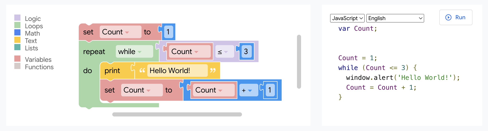

# W10 - Low Code Approach for Teaching Programming

Imagine being a 10-year-old discovering programming for the first time. Instead of struggling with intricate text or confusing symbols, you are building programs by snapping together colorful blocks, just like assembling Lego. With a few clicks, you can bring characters on your screen to life. That's the beauty of Scratch—a visual programming language that makes coding simple, exciting, and full of creativity for everyone.

### Why low code approaches?

Programming used to be an exclusive field for mathematicians and computer scientists. However, in today’s world, digital technology influences almost every part of daily life, from smartphones and social media to smart appliances and connected classrooms. Knowing how these technologies work, or even how to create simple tools ourselves, should not be limited to a small group of experts. Low-code approaches, like those in Scratch and other visual programming tools, remove complicated syntax and specialized terms, making programming accessible to anyone who is curious to learn.

Beyond professional software development, programming, and especially computational thinking, provide a strong method for solving problems in many areas. Computational thinking involves breaking big tasks into smaller parts, noticing patterns, and finding structured solutions. You can use these skills for organizing data in a research project, automating repetitive tasks in an office, or even planning and budgeting an event. Even if you never become a professional programmer, the way of thinking you gain from computational thinking can make you more efficient, creative, and flexible as a problem solver.

By seeing that programming is about more than writing code, platforms like Scratch act as gateways to a wider understanding of logic, design thinking, and collaboration. It encourages users—especially children and educators—to explore, experiment, and share their projects with a global audience, while developing valuable thinking skills. But Scratch is not alone. Over the years, an ecosystem of visual programming tools has emerged, each innovating in unique ways. Let's take a journey through some of the most impactful alternatives, compare them to Scratch, and explore how these tools are shaping the future of programming.

## The Rise of Visual Programming

### Scratch: Programming for all

Developed by the MIT Media Lab, Scratch stands out for its simplicity and inclusivity, making programming accessible to beginners of all ages. By utilizing a drag-and-drop interface, Scratch eliminates the barriers of intimidating syntax, allowing users to focus on logic and creativity rather than technical details. Its block-based approach represents programming constructs like loops, conditionals, and variables in an intuitive way. Scratch's online community plays an essential role, enabling users to share projects and remix others' work, enhancing collaborative learning and fostering a sense of belonging.

### Algot: Build Programs by Demonstration

While Scratch focuses on making programming very accessible with drag-and-drop blocks, Algot takes a different route by tackling the mental workload involved in learning to program. In particular, Algot uses Programming by Demonstration (PBD), which lets students create programs by directly manipulating data in a visual environment. Instead of writing lines of code or stacking blocks, learners can change values or move objects on the screen and see instant feedback on how the program behaves. This method reduces the effort needed to grasp the basics of programming, especially for university undergraduates and first-time learners, because it focuses on direct actions and immediate results, rather than on remembering syntax or complex instructions. Consequently, Algot’s approach makes programming more intuitive and less intimidating for beginners, setting it apart from other visual tools like Scratch.

### Strawbies: A Tangible Programming Game

Taking a step beyond the screen, Strawbies combines tactile and digital learning, making programming more accessible to children aged 5 and up. Using physical coding blocks and an interactive platform, players can guide characters through a world filled with interactive objects that encourage problem-solving and creativity. Designed for collaboration, it allows groups to play together and by integrating physical interaction enhances the understanding and retention of learning concepts.

## Not Just for Kids: Bridging the Gap from Blocks to Code

Visual programming is not only child's play, it is also transforming how people of all ages engage with technology and easing the transition to traditional programming languages.

### Bridging the Gap with Hybrid Tools

Transitioning from beginner-friendly tools like Scratch to more complex programming environments can be challenging. Platforms like Blockly and Alice have emerged to bridge this gap. Blockly plays a key role by enabling a smooth transition from block-based interfaces to text-based programming. It provides a dual interface where users can see the equivalent text-based code generated from their block-based programs, allowing learners to gradually adopt traditional languages such as JavaScript or Python. This transparency allows for the demystification of syntax, showing learners how their logical constructs built with blocks are translated into actual code.

Similarly, Alice complements this approach with an immersive 3D interface that introduces fundamental programming concepts. By allowing users to manipulate objects in a 3D space while introducing Java or C++ code snippets, it provides a gentle introduction to textual programming and helps learners visualise abstract ideas in an engaging and intuitive way.

### Real-World Applications and Motivation

For teens and adults, MIT's App Inventor connects programming with real-world applications. Users design and build mobile apps, learning coding principles while solving meaningful problems. By focusing on outcomes that matter to users, App Inventor motivates learning through practical relevance. It is not just about coding, it is also about creating tools that can impact daily life.

### Educational Strategies for Transitioning

Educators are developing curricula that integrate visual and textual programming. By starting with block-based coding to build confidence and then introducing text-based languages, learners can transfer their understanding of programming concepts without being overwhelmed by syntax. Studies have shown that this scaffolding approach can lead to better retention and a deeper understanding of programming principles.

## The future beyond blocks

As technology evolves, so do the tools we use to teach and learn programming. Visual programming is set to expand in fascinating directions.

### AI-Assisted Programming

Imagine a future where programming starts with a simple conversation. You explain what you want to create in everyday language, and artificial intelligence translates your ideas into initial code structures in a block-based visual environment. One system that illustrates this concept is Helena. Developed to automate tasks on the web (for example, gathering data from multiple pages or filling out online forms), Helena takes natural language instructions and turns them into a block-based workflow that users can then refine. By allowing people to instruct the system in a more familiar manner, Helena lowers the barrier to automation, making it easier for those without a strong coding background to accomplish repetitive web tasks.

Beyond Helena, there are other research projects pushing the boundaries of AI-assisted programming. For instance, SQLucid explores ways to translate natural language queries into SQL code. It offers an interactive environment where users can refine or customize the generated queries based on their specific data requirements. This approach is particularly useful for individuals who need to work with databases but find learning SQL syntax challenging. With SQLucid, they can describe the data they want, and the system will generate or suggest SQL statements, significantly speeding up the query-building process.

In this AI-supported future, you would see your ideas come to life right away, connecting your everyday words with computational logic. As you add more detail and gain confidence, you could move on to mixed tools that combine visual blocks with text-based code, allowing finer control. Throughout the journey, AI would provide real-time suggestions, personalized learning pathways, and instant error detection, making the leap from idea to implementation feel more natural than ever.

### Mixed Reality

The success of Strawbies points to the potential of merging physical interaction with digital programming. Mixed reality technologies, which include both virtual reality (VR) and augmented reality (AR), can push this even further by placing learners in a 3D programming environment that blends the digital world with the physical one around them. In VR, users wear a headset that immerses them in a fully virtual space where they can grab, move, or modify objects as if they were real.

Within these settings, the concept of programming by demonstration allows users to define behavior and logic through direct, hands-on interaction. For example, moving a virtual character or resizing an object with a simple gesture could instantly generate or adjust the underlying code, reproducing those actions programmatically, removing the need to memorize or type instructions.

By making coding more tangible, mixed reality opens doors to new forms of experiential learning, where exploration and experimentation happen naturally. Learners see immediate feedback as virtual components interact in real time, and they can test ideas by physically engaging with objects instead of typing abstract commands. This tight integration of physical and digital domains makes complex concepts easier to grasp and fosters creativity. Consequently, mixed reality redefines the role of the programmer as an active participant in the programming space, making coding more intuitive, engaging, and aligned with the way we learn best.

## Final thoughts

Visual programming tools, from Scratch to Algot and Strawbies, are reshaping how learners of all ages engage with computational thinking. By lowering the barriers traditionally posed by complex syntax, these tools foster a sense of creativity and confidence that can be difficult to achieve when faced with text-based languages early on. As learners progress, hybrid platforms like Blockly and Alice ease the transition toward more advanced environments, such as Python or Java, ensuring that a foundation of logic and design thinking remains at the core.

At the same time, developments in AI and mixed reality point towards a future where the boundaries between human expression and computational logic become thinner. Systems like Helena and SQLucid illustrate how natural language can be a direct pathway into coding, while mixed reality environments allow users to touch, move, and shape code in 3D space. These emerging techniques can make programming not just more accessible, but also more meaningful and fun, enhancing experimentation, collaboration, and innovation in every step.

### Reading List

* [Algot](https://algot.org/): Thorgeirsson, S., Weidmann, T. B., Weidmann, K. H., & Su, Z. (2024, March). Comparing Cognitive Load Among Undergraduate Students Programming in Python and the Visual Language Algot. In Proceedings of the 55th ACM Technical Symposium on Computer Science Education V. 1 (pp. 1328-1334).
* [Scratch](https://scratch.mit.edu/): Resnick, M., Maloney, J., Monroy-Hernández, A., Rusk, N., Eastmond, E., Brennan, K., ... & Kafai, Y. (2009). Scratch: programming for all. Communications of the ACM, 52(11), 60-67.
* [Strawbies](https://tidal.northwestern.edu/blog/strawbies/): Hu, F., Zekelman, A., Horn, M., & Judd, F. (2015, June). Strawbies: explorations in tangible programming. In Proceedings of the 14th International Conference on Interaction Design and Children (pp. 410-413).
* [Alice: A 3-D Tool for Introductory Programming Concepts](https://dl.acm.org/doi/10.5555/364133.364161): Stephen Cooper, Wanda Dann, and Randy Pausch. 2000. Alice: a 3-D tool for introductory programming concepts. J. Comput. Sci. Coll. 15, 5 (May 2000), 107-116.
* [App inventor and real-world motivation](https://doi.org/10.1145/1953163.1953329): David Wolber. 2011. App inventor and real-world motivation. In Proceedings of the 42nd ACM technical symposium on Computer science education (SIGCSE '11). Association for Computing Machinery, New York, NY, USA, 601-606.
* [Ten things we've learned from Blockly](https://doi.org/10.1109/BLOCKS.2015.7369000): Neil Fraser. 2015. Ten things we've learned from Blockly. In Proceedings of the 2015 IEEE Blocks and Beyond Workshop (Blocks and Beyond) (BLOCKS AND BEYOND '15). IEEE Computer Society, USA, 49-50.
* [Transitioning from introductory block-based and text-based environments to professional programming languages in high school computer science classrooms](https://doi.org/10.1016/j.compedu.2019.103646): David Weintrop and Uri Wilensky. 2019. Transitioning from introductory block-based and text-based environments to professional programming languages in high school computer science classrooms. Comput. Educ. 142, C (Dec 2019).
* [SQLucid: Grounding Natural Language Database Queries with Interactive Explanations](https://dl.acm.org/doi/fullHtml/10.1145/3654777.3676368): Yuan Tian, Jonathan K. Kummerfeld, Toby Jia-Jun Li, and Tianyi Zhang. 2024. SQLucid: Grounding Natural Language Database Queries with Interactive Explanations. In The 37th Annual ACM Symposium on User Interface Software and Technology (UIST '24), October 13--16, 2024, Pittsburgh, PA, USA. ACM, New York, NY, USA 20 Pages.
* [Helena | Web Automation for End Users](https://helena-lang.org)
