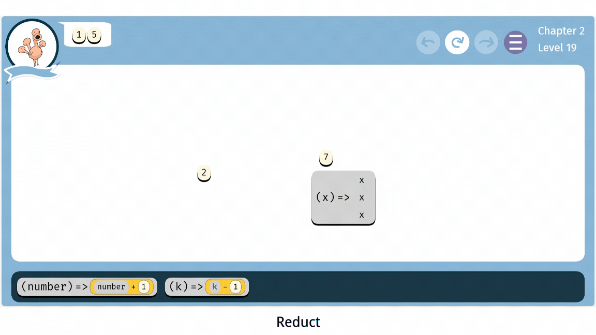
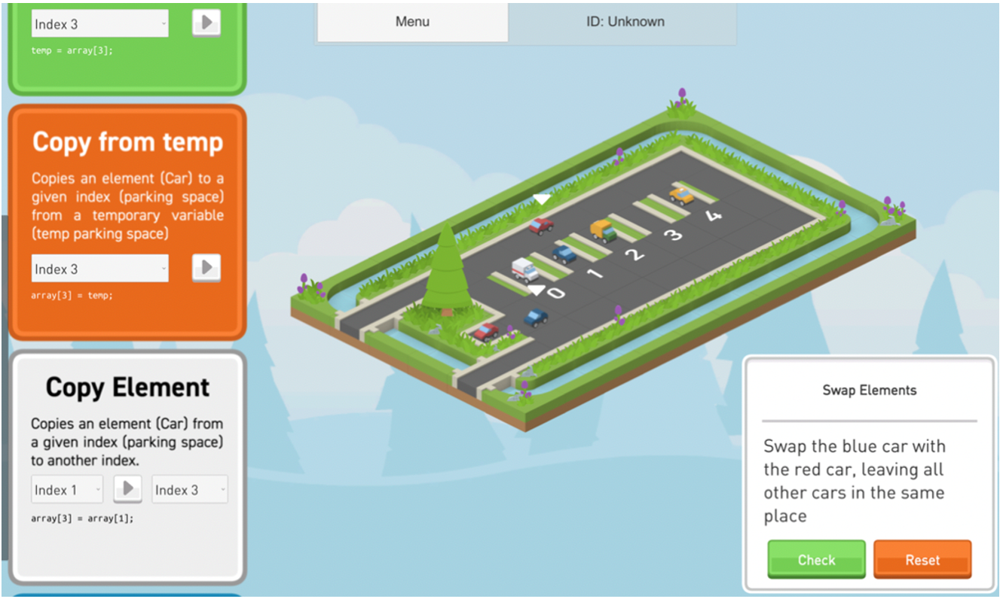
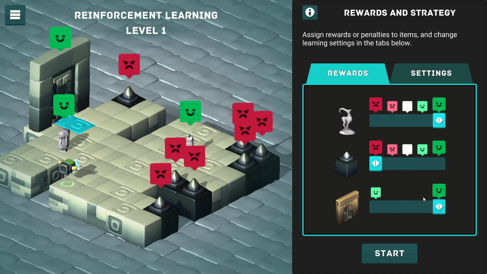
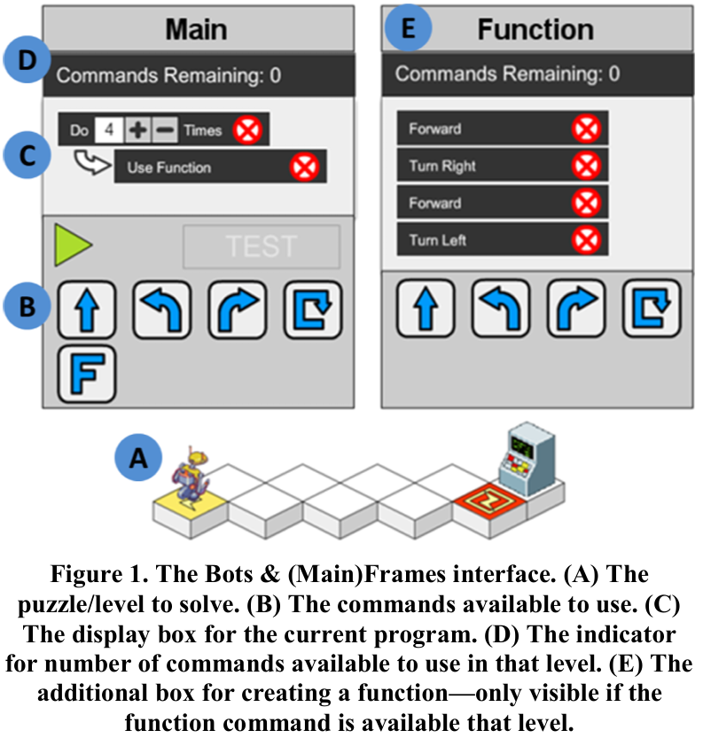
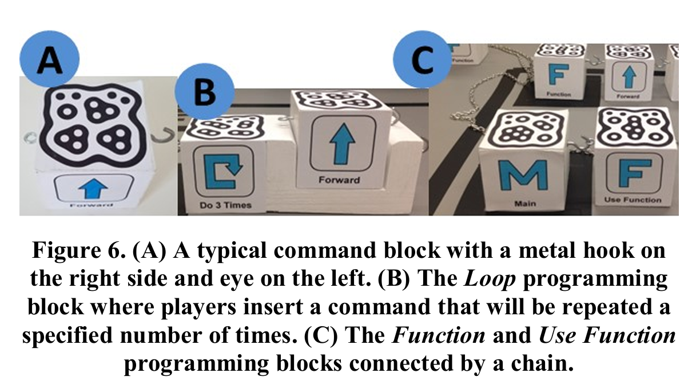

# W11 - Educational Games for Programming

Programming is becoming an indispensable part of our daily lives, shaping industries from healthcare to entertainment. As a result, more people are diving into the world of coding, often through self-study. But how do you start? For novices, the learning pathways are diverse—from traditional books to massively open online courses (MOOCs) like Codecademy, edX, and Khan Academy. Creative tools like Scratch[^1] and Alice or educational games like LightBot[^2] and Gidget[^3] offer engaging and interactive ways to begin.

Join me, Ziyu Ma, a second-year master's student at ETH, as we delve into the world of educational programming games.

## Examples of Educational Programming Games

Educational programming games share common design features, often teaching concepts through a series of levels. Players guide a character to solve puzzles by applying programming principles using a mouse, keyboard, or touchpad[^4]. Let’s explore a few notable examples:

### Block-Based Programming Games

Syntax is a known barrier to entry for novices. To address this, block-based programming games use graphical, drag-and-drop interfaces that make syntax errors impossible. These games introduce core concepts with minimal reliance on natural language, benefiting non-English users and underrepresented populations.

 

* **LightBot**: Players command a robot to navigate mazes and turn on lights by arranging blocks of symbols to create instructions. Without typing any code, users learn sequencing, procedures, overloading, recursive loops, and conditionals.
* **Reduct**: This game introduces concepts like functions, Booleans, equality, and conditionals, and mapping functions over sets. Players drag blocks into other blocks and execute code using reduction-based operational semantics.

### Code-Based Programming Games

These games require players to write code, offering an introduction to syntax.

 

* **Gidget**: This online debugging game engages players in fixing faulty code provided by a robotic character to complete missions. Using a Python-like language designed specifically for the game, players learn variables, functions, loops, stack, and debugging by executing code line by line.
* **CodeCombat**: Offering visually appealing gameplay, CodeCombat allows users to write code in popular languages like Python, JavaScript, and C++. It teaches loops, strings, functions, and more while covering computer science fundamentals and introductory game and web development concepts.

### Games for Advanced Concepts

While most educational programming games focus on foundational topics, a select few tackle more advanced concepts.

 

_Left: DeCode, Right: ArtBot_

\

* **Data Structures and Algorithms (DSA)**: Studies have shown that traditional visual aids like diagrams and animations often fall short in teaching data structures and algorithms effectively due to a lack of interactivity and motivational appeal[^5]. Games such as **DeCode** address this gap by introducing arrays, lists, queues, and stacks through creative metaphors. In DeCode, data elements are represented as vehicles and memory locations as parking spaces.
* **Object-Oriented Programming (OOP)**: **POO SG** uses a zoo setting where animals serve as objects. Players interact with these objects to learn core OOP principles such as classes, inheritance, and polymorphism.
* **Artificial Intelligence (AI)**: With AI becoming a vital part of modern technology, some games have started to introduce learners to key AI concepts. **ArtBot**, for instance, allows players to train an image classifier by tweaking parameters. Players can also train a reinforcement-learning robot by selecting rewards, adjusting training durations, balancing exploration and exploitation, and setting learning rates. These activities provide an engaging way to explore AI principles like decision-making and optimization.
* **Collaborative Learning in AI**: While many AI games are designed for solo play, **Co-ML** takes a collaborative approach. It encourages learners to work together to collect data for machine learning image classifiers. For example, a family setting collaborates on designing datasets, addressing challenges like data diversity, class imbalance, and quality.

## Theories and Effectiveness of Educational Programming Games

Why choose educational programming games over other learning methods? Are they truly effective, or are they simply an entertaining distraction? An experiment[^6] was conducted to evaluate three different learning methods: the Python course on **Codecademy**, the debugging puzzle game **Gidget**, and Gidget’s open-ended creative environment called the **Puzzle Designer**, which is similar to tools like Scratch and Alice. Each of these approaches is based on a distinct teaching philosophy.

* **MOOCs** like Codecademy adopt a traditional classroom-style approach, offering structured lessons and exercises that guide learners through programming topics step by step.
* **Open-ended creative environments** are rooted in constructivist teaching theories. These platforms foster self-discovery by encouraging learners to experiment, make mistakes, and build projects independently. However, without guidance from experienced mentors, learners may struggle to understand why their programs work, potentially limiting their conceptual understanding.
* **Educational programming games**, on the other hand, often follow a comprehension-first approach. This method prioritizes helping learners develop a clear mental model of programming concepts before diving into hands-on practice.

The study assessed using pre- and post-tests comprising multiple-choice questions to measure understanding of programming concepts. Results showed that Gidget and Codecademy achieved similar improvements, but Gidget achieved these results in half the time. Open-ended environments showed no significant improvement. These findings suggest that puzzle-based, comprehension-first educational games like Gidget can teach programming concepts more efficiently than tutorial-based or construction-first approaches. However, the experiment’s scope was limited to basics. How these results translate to more advanced concepts remains uncertain.

## Exploring the Design Decisions in Educational Programming Games

  

\

_From left to right: Bots & (Main)Frames, Bots & (Main)Frames Blocks, Osmo_

\

Studies also examine alternative design decisions in educational games[^4]. For example, a game called **Bots & (Main)Frames** explored using tangible blocks as input methods and collaborative play. The results showed that tangible input increased engagement and learning outcomes, while collaboration reduced programming anxiety.

However, tangible designs are often impractical for complex operations, such as loops with varying body sizes. Also, they are hard to transport. **Osmo** is an educational programming game that uses tangible plastic pieces to interact with an iPad. These lightweight and portable objects serve as a potential inspiration for designing similar blocks.

## The Future of Educational Programming Games

1. **A Centralized Platform for Programming Games**: Currently, various programming games cover specific aspects of coding, often focusing on narrow topics, since game developing is a time-consuming process. A future solution could involve creating a website that categorizes all relevant programming games, organizes them by topic, and arranges them into a coherent learning sequence. Such a resource could also integrate games with traditional courses to balance concept learning with syntax mastery.
2. **Games for Neural Network Education**: With AI becoming increasingly central to technology, future educational games could focus on teaching neural network concepts. These games might:

* Visualize neural network layers as 3D Lego-like blocks of various sizes.
* Represent components like encoders, decoders, and transformers as building blocks for various architectures, e.g. a stable diffusion model. Players could experiment with these virtual components, learning how they interact and fit together to build complex AI systems.

3. **Tangible and XR-Based Games**: Transforming programming games into tangible formats can be particularly beneficial for young learners. Emerging technologies like augmented reality (AR) and virtual reality (VR) could address potential problems by manipulating virtual blocks in immersive environments.

## Conclusion

Educational programming games are powerful tools for teaching core programming concepts. While most games focus on basics, future developments could expand into advanced topics and leverage emerging technologies. Combining these games with traditional learning methods could create a comprehensive and enjoyable pathway for coding education.

## References

[^1]: Resnick, M., Maloney, J., Monroy-Hernández, A., Rusk, N., Eastmond, E., Brennan, K., Millner, A., Rosenbaum, E., Silver, J., Silverman, B., & Kafai, Y. (2009). Scratch: Programming for all. Communications of the ACM, 52(11), 60–67. https://doi.org/10.1145/1592761.1592779.

[^2]: Wikipedia contributors. (n.d.). Lightbot. Wikipedia. https://en.wikipedia.org/wiki/Lightbot.

[^3]: Lee, M. (2014). Gidget: An online debugging game for learning and engagement in computing education. In 2014 IEEE Symposium on Visual Languages and Human-Centric Computing (VL/HCC) (pp. 193-194).

[^4]: Melcer, E., & Isbister, K. (2018). Bots & (Main)Frames: Exploring the Impact of Tangible Blocks and Collaborative Play in an Educational Programming Game. In Proceedings of the 2018 CHI Conference on Human Factors in Computing Systems (pp. 1–14). Association for Computing Machinery.

[^5]: Su, S., Zhang, E., Denny, P., & Giacaman, N. (2021). A Game-Based Approach for Teaching Algorithms and Data Structures using Visualizations. Proceedings of the 52nd ACM Technical Symposium on Computer Science Education, 1128–1134. Presented at the Virtual Event, USA. doi:10.1145/3408877.3432520.

[^6]: Lee, M., & Ko, A. (2015). Comparing the Effectiveness of Online Learning Approaches on CS1 Learning Outcomes. In Proceedings of the Eleventh Annual International Conference on International Computing Education Research (pp. 237–246). Association for Computing Machinery.
