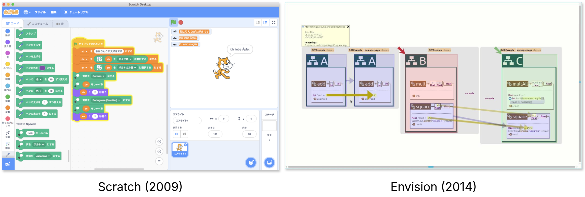
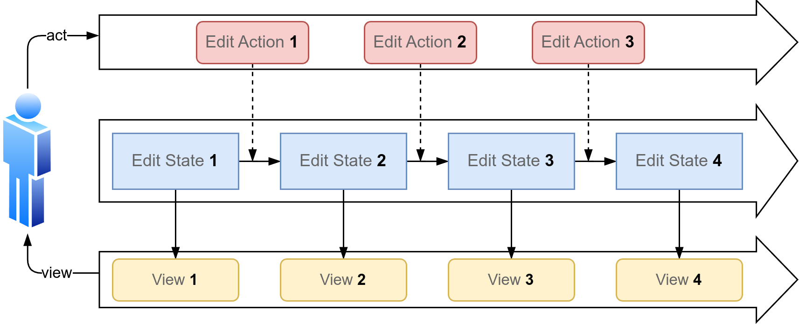
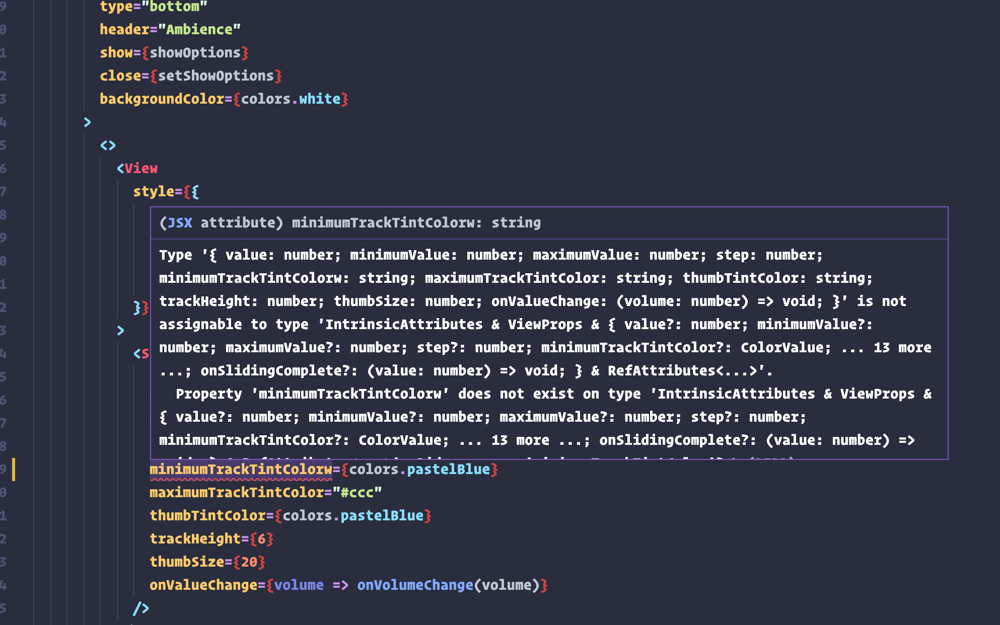

# Structure Editors -- Formal Language Theory for Provably Correct Program Analysis

There is a famous theorem, called the "infinite monkey theorem"[^1], which states that an immortal monkey typing at random on a typewriter, for an infinite amount of time, will eventually reproduce every single work of literature ever written, including complete works of William Shakespeare. The same statement can also be applied to a monkey programmer typing on a computer keyboard, that will eventually write every single correct program. Unfortunately for programmers, the number of valid programs, although infinite, is vanishingly small in comparison to all possible combinations of symbols. As such, typing monkeys are not a good replacement for developers. Programmers need to know the program syntax to produce correct code. Especially for beginner programmers, this can distract from learning the essence of programming, which does not care for any syntactical trivialities, resulting from our limitations in effectively communicating with computers. In this spirit, let's build a special kind of typewriter, that instead of producing garbage text most of the time, **always** produces a **valid program** with every keystroke. This special typewriter encapsulates the main concept behind **structure editors**.

#### What Are Structure Editors?

Early works in the field of structure editors include the Cornell Program Synthesizer[^2], in which the authors note that programs are not simply text, but instead complex syntactical structures, which should also be edited, executed, and debugged as such. Perhaps the most well-known structure editor is Scratch[^3], which allows users to drag and drop program blocks to form a program. Researchers have tried several variations on this concept, including hybrid approaches such as Envision[^4], which allows users to switch between graphical and textual representations of code, and quickly scaffold common program structures with keyboard commands.

Unfortunately, such visual code editors get impractical and slow when working with larger projects in professional environments. The upside of textual programming interfaces lies in their versatility: It doesn't matter what language the programs are written in, what programming paradigm is used (e.g., object-oriented vs functional), or what level of abstraction a programming language belongs to; The trusted text interface can handle it all. On the other hand, when designing a structure editor, it is necessary to make many trade-offs regarding ease of use vs. development speed, generality vs. specialization, and the knowledge level the structure editor is designed for. Despite all of these downsides, structure editors still have their place. If done right, they can provide a fail-safe programming environment for developers at any experience level, additionally allowing for an easy understanding of the program structure as a whole.

#### The Hazel Structure Editor

At this point, we seem to have conflicting interests: We want to eliminate invalid program states while maintaining a familiar development environment suitable for advanced programmers. Inevitably, as you write a program, not all states will be valid programs. The text might contain errors and missing parts. But as it turns out, it is indeed possible to reconcile these two goals, which is exactly what the researchers behind the Hazel[^5] programming environment did. Instead of looking at programs as just text, which can be valid or invalid, we treat *every* text as valid, and augment the program text with "blanks", which the programmer still needs to fill out or correct. While the underlying program written in Python or Haskell might be incomplete, the text is still a valid program in the Hazelnut formalism (now called an **edit state**). If additionally, we treat a program as a sequence of **edit actions** that the programmer made to produce the program, we effectively created a system where the programmer can write code as usual, but *every* edit state is a valid state. In short, no matter what the programmer types, and no matter how wrong the underlying program may be, the text is still a valid program in the Hazelnut formalism.

To implement Hazel, we need to define an empty edit state, and translate user inputs (e.g. key presses) into edit actions, which in turn transform the current edit state into another edit state. We can derive the underlying program from an edit state and display it in the editor; However, at this point we have a formal understanding of the semantics of the program, such as which parts are correct or where there is some missing code. This is in contrast to traditional code diagnostics, which rely on heuristics to infer the semantics of an incomplete program.

Under the hood, Hazel uses tools from formal type theory, especially typed lambda calculi, to formally define the semantics and well-typedness of a given program. Hazelnut's design makes it impossible to apply an edit action that results in an ill-typed edit state, given that the initial edit state was well-typed. Thanks to this, we have a provable guarantee for correctness in every state. You can try the Hazel editor in action at [https://hazel.org/build/dev/](https://hazel.org/build/dev/).

#### Hazel Alternate Use-Cases

While in my personal experience, the benefits of the method are not immediately apparent from the paper and the live demo the authors provide, other works have used this framework to implement provably correct editor diagnostics features. For example, it is possible to leverage the formal grammar to provide a better starting point for code auto-completion, as the required type for program holes is known[^6]. Another possible application close to my heart as a web developer is type error localization. Anyone who has worked with TypeScript professionally knows the horrors that the TypeScript type system can produce:

Such errors are utterly unreadable, causing developers to simply ignore the error message. Developers would then rely on their common sense or other heuristics to find the error. We can leverage the information given by type holes (which represent missing or incorrect types in a partial program) to provide more localized and meaningful information about a given type error, pinpointing the error to the developer[^7].

#### The Future of Structure Editors

At the point of writing this, the benefits of structure editing outside of education are limited and too specific to particular programming languages or paradigms. However, I think that in the future, with the advent of alternative input methods such as touch or even augmented reality for program writing, structure editors will become more and more relevant and useful. Structure editors could additionally lower the entry barrier for non-technical people to quickly contribute changes to a code base without needing to understand the intricacies of program syntaxes. Now we are also seeing more and more AI-generated code, which relies on iterated syntax checking to produce correct code. With structure editing, we could simplify the process by letting LLMs interact directly with structure editors such as Hazel to generate provably correct code at reduced inference costs. This could be achieved by modeling next-token probabilities as distributions over tokens allowed by the structure editor, instead of distributions over the full token vocabulary. In professional software development, I see structure editors as a principled foundation for provably correct error reporting and code suggestions, tightly integrated into the text-based code editors that we use daily. All these benefits together will make us developers more efficient, more correct, and better learners than we are now.

## References

[^1]: Borel, É. (1913). La mécanique statique et l'irréversibilité. *J. Phys. Theor. Appl.*, *3*(1), 189-196.
[^2]: Teitelbaum, T., & Reps, T. (1981). The Cornell program synthesizer: a syntax-directed programming environment. *Communications of the ACM*, *24*(9), 563-573.
[^3]: Resnick, M., Maloney, J., Monroy-Hernández, A., Rusk, N., Eastmond, E., Brennan, K., ... & Kafai, Y. (2009). Scratch: programming for all. *Communications of the ACM*, *52*(11), 60-67.
[^4]: Asenov, D., & Muller, P. (2014, July). Envision: A fast and flexible visual code editor with fluid interactions (overview). In *2014 IEEE Symposium on Visual Languages and Human-Centric Computing (VL/HCC)* (pp. 9-12). IEEE.
[^5]: Omar, C., Voysey, I., Hilton, M., Aldrich, J., & Hammer, M. A. (2017). Hazelnut: a bidirectionally typed structure editor calculus. *ACM SIGPLAN Notices*, *52*(1), 86-99.
[^6]: Pelsmaeker, D. A., van Antwerpen, H., Poulsen, C. B., & Visser, E. (2022). Language-parametric static semantic code completion. *Proceedings of the ACM on Programming Languages*, *6*(OOPSLA1), 1-30.
[^7]: Zhao, E., Maroof, R., Dukkipati, A., Blinn, A., Pan, Z., & Omar, C. (2024). Total type error localization and recovery with holes. *Proceedings of the ACM on Programming Languages*, *8*(POPL), 2041-2068.
